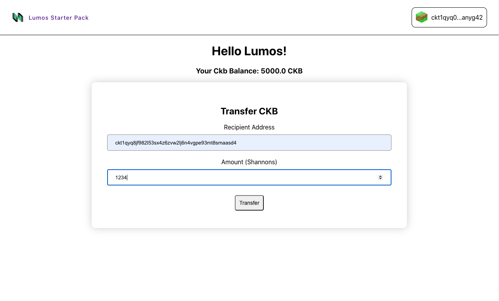
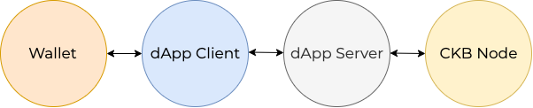

# Hello Lumos ☀️ Dapp Template

This project is a Typescript + React template to get you started building dApps for [CKB](https://docs.nervos.org/), using the [Lumos](https://github.com/nervosnetwork/lumos) framework.

It's designed to kickstart your project by providing functional examples of how to:

- Query data from the blockchain.
- Interact with CKB wallets ([Keypering](https://github.com/Keith-CY/keypering/) is supported out of the box).
- Build, sign, send, and track transactions.

See the [Video Walkthrough](https://www.youtube.com/watch?v=9U23hrzCAiM) for an overview of the architecture and code walkthrough.

### Looking to learn more about Lumos?

Check out the [docs](https://github.com/nervosnetwork/lumos), the intro [tutorial](https://docs.nervos.org/docs/labs/lumos-nervosdao), as well as the third entry in the [Dapps on CKB video workshop](https://www.youtube.com/watch?v=TJ2bnSFUpPQ).

# Setup

## Install

`yarn install`

## Prepare External Components

The app will need a CKB node, and Keypering instance to connect to.

- You can specify the URL of a CKB node to connect to in the server `.env` file
    - The app is configured to connect to a local AGGRON4 testnet node by default ([How to run a local node](https://docs.nervos.org/docs/basics/guides/testnet))

- Ensure a local Keypering instance is running at the URL specified in client app. Keypering can be [built from source]((https://github.com/Keith-CY/keypering/)), or [downloaded](https://github.com/Keith-CY/keypering/releases) via the latest release for your platform.

## Run

`yarn start`

### Getting funds for your test wallet

The [CKB Testnet Faucet](https://faucet.nervos.org/) can be used to claim testnet CKB for your Keypering wallet.

# The Components

## Client

The client serves as the point of interaction for users. It handles queries and transactions for the blockchain via the dApp server, and gets required signatures for transactions from the Wallet.

#### Component Interactions

### The Stack

The client is based on the [create-react-app](https://create-react-app.dev/docs/getting-started/) typescript template. [Styled-components](https://styled-components.com/) is used for the bulk of styling. [React-hook-form](https://react-hook-form.com/) is used for a clean, lightweight form handler. State managment is handled in a lightweight fashion using hooks.

While a project of this complexity ultimately has to make some opinionated choices, we hope it can still be useful to those who prefer a different JS stack. The architecture and code snippets for Lumos & CKB interaction will be generally applicable for integration into other framework(s).

A lighter weight dapp that also uses Kepyering can be found at the [simplest dapp](https://github.com/duanyytop/simplestdapp).

There are a set of **Stores** that maintain application-level state. They make use of the useContext() react hook to allow usage anywhere in the application.

The **Services** manage interaction with other components, such as the dApp server and wallet.

---
## Server

The server is essentially a wrapper around the Lumos indexer & transaction generation functionality. The example server here is a small express server with typescript to get you started.

It features a simple REST api for the queries and actions required by the client.

- **General** routes for querying the node directly, without having to maintain it's own connection.
- **Indexer** routes for core indexer functions (querying for cells and transactions).
- **Ckb** routes for handling ckb balances and transfers.

## A note on numbers

Numerical values are stored as `BigInt` form for comparison, because numbers in the CKB system can exceed the maximum value that can be safely stored in Javascript numbers. These are converted to strings when required (passing via API, serialization, display). Certain formatter methods use `bignumber.js` for its' convenient formatting options.

## A note on CKB transfers

The minimum transfer amount is 61 CKBytes (6100000000 Shannons). This is because enough CKBytes must be provided such that a new cell can be created for the recipient. Attempting to transfer less than this amount will result in a "Transaction: InsufficientCellCapacity" error.
