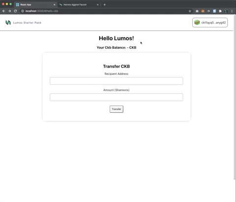

# Hello Lumos ☀️ Dapp Template
This project is a template to get you started building dApps for [CKB](https://docs.nervos.org/), using the [Lumos](https://github.com/nervosnetwork/lumos) framework!

It's designed to kickstart your project by providing functional examples of how to:
* Query data from the blockchain
* Interact with CKB wallets
* Build, sign, send, and track transactions

The template is divided into two components, the *client* and the *server*. More on that later.

## Install
1. Run `yarn install` in the root directory to install dependencies for both server & client.
___
## Configure
The client and server both need some env variables set to get started.

#### Client Config:
1. Navigate to the /client folder & copy `.env.example` -> `.env` 

2. Replace `REACT_APP_PRIVATE_KEY` with a private key of choice for using the in-memory wallet.

> ⚠️ This wallet is not secure, never use this key on mainnet or to otherwise secure any assets with value!

#### Server Config:
1. Navigate to the /server folder & copy `.env.example` -> `.env`. (It's not necessary to change any values, unless you want to connect to a CKB node at a different URI).
___
## Run
Ensure a local CKB node connected to Aggron4 testnet ([guide here](https://docs.nervos.org/docs/basics/guides/testnet)) is running at the URI specified in the server `.env` config.

1. Start server: 

    `yarn start` from /server folder

2. In a separate terminal, start client: 
    
    `yarn start` from /client folder

### Getting funds for your test wallet.
Navigate to `localhost:3000` and check out your app. You'll see the address of your private key, but we'll need some funds in order to test the CKB transfer.

1. Click the wallet navbar to open up the wallet interface

2. Click the 'copy' modal to copy your address

3. Take that address to the [CKB Testnet Faucet](https://faucet.nervos.org/) & claim some testnet CKB

4. Once the transaction is processed, come back & refresh to see your new balance!

# The Components
## Client
The client serves as the point of interaction for users. It handles queries and transactions for the blockchain via the dApp server, and forwards requests for the users' signature to the wallet.

#### Component Interactions

> (For now, the wallet is an example wallet that is actually stored locally in the app. In the future, we'll support Keyperring as a standard interface to external wallets).

### The Stack
The client is based on the create-react-app typescript template. Styled-components is used for the bulk of styling. React-hook-form is used for a clean, lightweight form handler. State managment is handled in a lightweight fashion using hooks.

If you prefer a different stack, no worries - there are still be plenty of useful snippets related to CKB interaction that can be used with your framework(s) of choice.

There are a set of **Stores** maintain application-level state. They make use of the useContext() react hook to allow usage anywhere in the application.

The **Services** abstract away interaction with other components, such as the dApp server and wallet.
___
## Server  
The server is essentially a wrapper around the Lumos indexer & transaction generation functionality. The example server here is a small express server with typescript to get you started.

It features a simple REST api for the queries and actions required by the client.

- **Indexer** routes for core indexer functions (querying for cells and transactions)
- **Ckb** routes for handling ckb balances and transfers

## A note on numbers
Numerical values are stored as `BigInt` form for comparison, because numbers in the CKB system can exceed the maximum value that can be safely stored in Javascript numbers. These are converted to strings when required (passing via API, serialization, display). Certain formatter methods use `bignumber.js` for its' convenient formatting options.

## A note on CKB transfers
The minimum transfer amount is 61 CKBytes (6100000000 Shannons). This is because enough CKBytes must be provided such that a new cell can be created for the recipient. Attempting to transfer less than this amount will result in a "Transaction: InsufficientCellCapacity" error.

## Want to learn more about Lumos?
Check out the [docs](https://github.com/nervosnetwork/lumos), the intro [tutorial](https://docs.nervos.org/docs/labs/lumos-nervosdao), as well as the video workshop (link pending).
